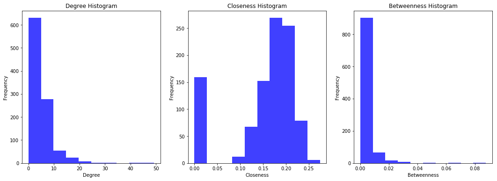
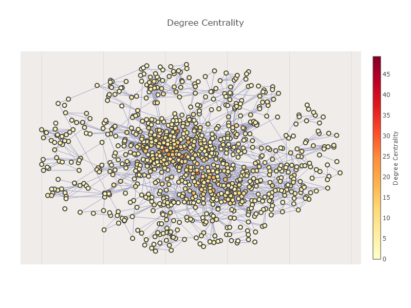
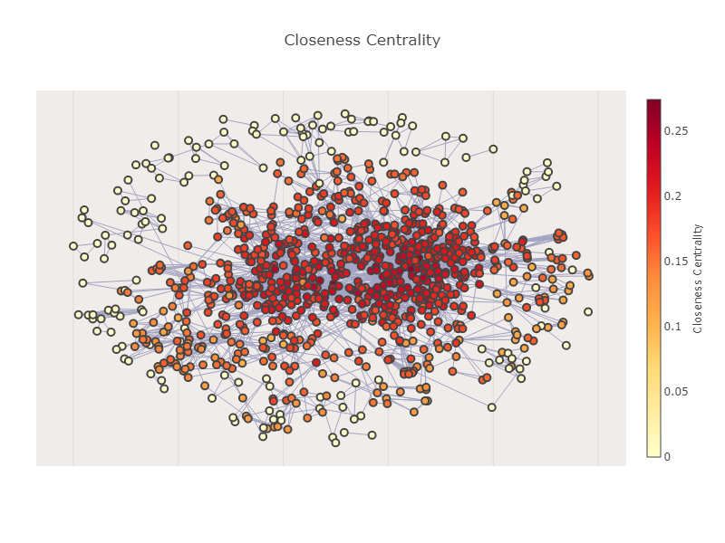
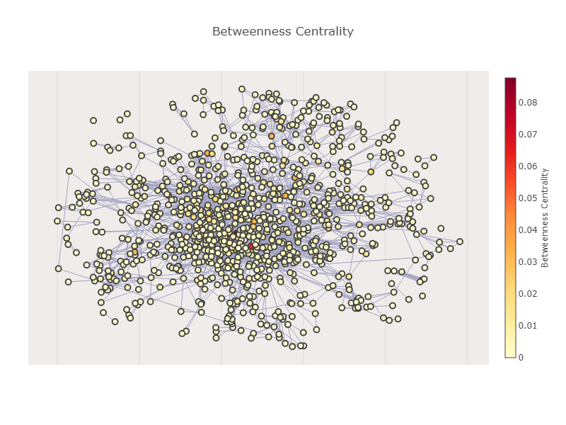
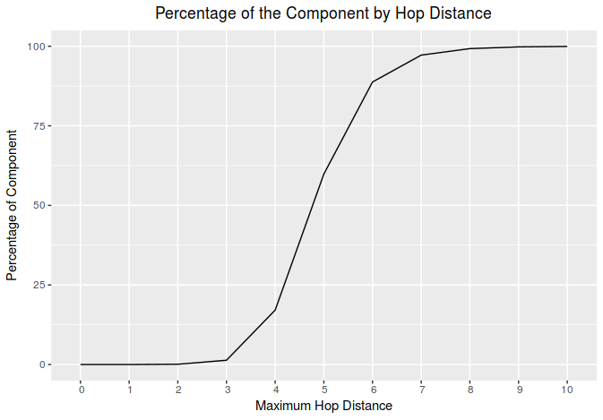
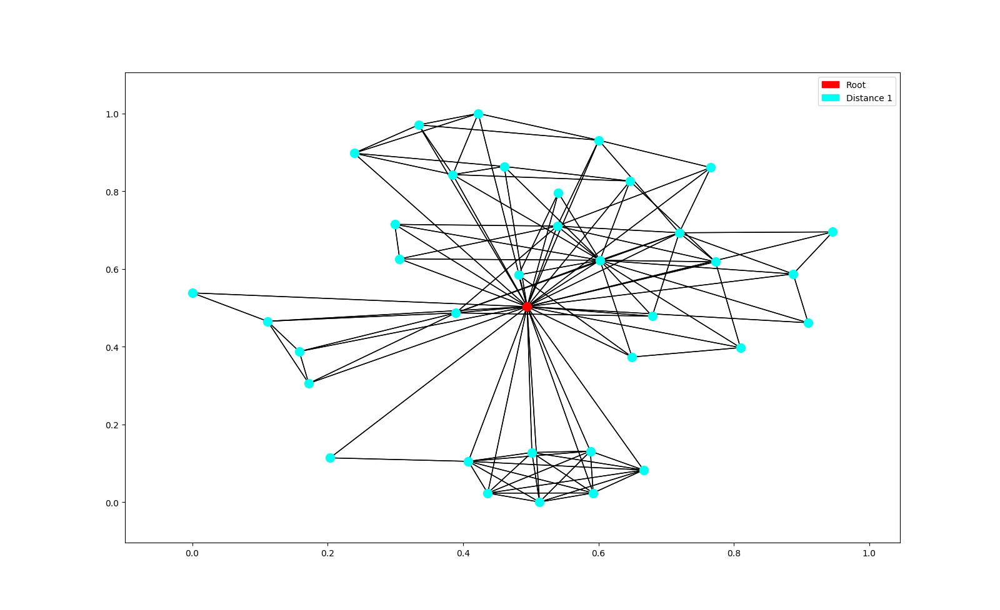
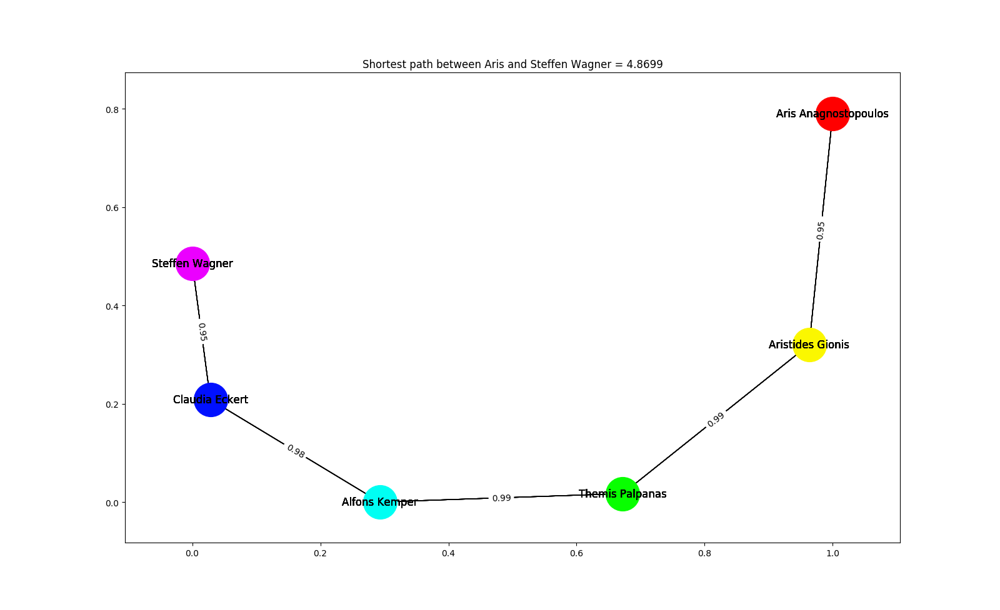
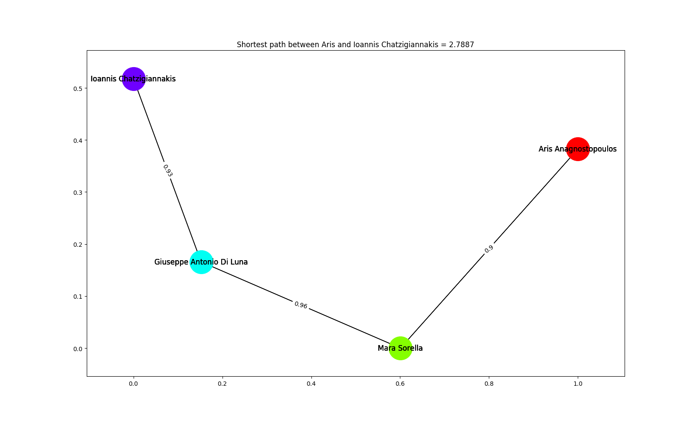

```{r setup, include=FALSE}
knitr::opts_chunk$set(echo = TRUE)
```

# Exercise 1

For the first exercise we had to create a graph whose nodes are authors, and two nodes are connected if they share, at least, one publication. Each edge is weighted in the following way: $$w(a_1, a_2) = 1 - J(p_1, p_2)$$ Where $J(p_1, p_2)$ is the Jaccard similarity between the set of publications $p_1$ and $p_2$ of each author.

The resulting graph (when using the full dataset) is a disconnected graph with a total of 904664 nodes and 3679331 edges. The implication of being a disconnected graph is that not all nodes are reachable from every other node, meaning, for a specific pair of nodes $n_1$ and $n_2$, there might not be a path that connects $n_1$ and $n_2$. Moreover, if the weight of the edge, $w(a_1, a_2)$, between $a_1$ and $a_2$ is equal to 0 it means that nodes $a_1$ and $a_2$ only published between each other.

# Exercise 2

## Letter A

For this exercise we had to return the induced subgraph by the set of authors who published at a specific conference at least once. After creating the graph we analyse some centralities measures (degree, closeness and betweennes).

Let's check the results for conference 14805 and visualize each centrality. The plots shown below are not the interactive ones, they are just a static visualization of the whole graph for all the centralities measures. As reported in the readme file, if you want to interact with them, just run exercise2a.ipynb file.




\newpage

### Degree

{ width=50% }

The degree centrality take into account the edges that are adjacent to a certain node. From Figure 2, we can see that there are many nodes with a low degree centrality, and few with an higher centrality. This is confirmed by the histogram of the degree centralities, and it is mathematically related to a [power law distribution](https://en.wikipedia.org/wiki/Power_law). Essentially this phenomena can be described as a preferential attachment process: the more someone publish with other authors, the most probably that person is going to publish again. And this is something that happens in most of the natural processes of this world. Because of this, there are always going to be few professors with a higher number of co-authors, and many that published few times, and so with a small number of co-authors.

### Closeness

{ width=50% }

The closeness centrality take into account the normalized mean of the shortest paths between a certain node and all the other nodes. There is a peak in the distribution (Figure 1) for the small values close to 0, and this is given by the fact that there are many small different connected components that are not connected to the main one. All the other values are very close, given to the fact that it is basically a graph where all the nodes are relatively close to each others and well-connected, so the shortest paths are all very similar to each other, and there are few nodes that are "more connected" than others.

### Betweenness 

{ width=50% }

The betweenness centrality of a node take into account the number of shortest path between all the pairs of nodes in graph that pass through that node. In a big graph like this most of the values would be obviously 0, and most of the importance would be taken by the so-called "hubs", nodes with the highest degrees. In fact given the degree of a node, there is much more probability to pass through a node with many edges than others. A good example for this could be like an underground net: stations where most of the lines pass through are the more crowded, just because there is more probability to pass through them to get somewhere. This fact is also reflected in the distribution plotted in Figure 1.

\newpage

## Letter B

On this exercise we had to get the subgraph induced by the nodes that have hop distance at most equal to a given integer, with a given author.

We observe two things:
    
1. Because the graph is not connected we can never get the whole graph, even for a big hop distance.
2. For a small number (between 6 and 10) of maximum hop distance we get almost the whole connected component for one author.

Let's see the behaviour observed on 2.

For author who has id = 256176 (Aris Anagnostopoulos), the connected component has 792279 nodes, if we try with maximum hop distance from 0 to 10 we have the following result.

{ width=50% }

Just to illustrate, we show the graph for when maximum hop distance is equal to 1.

{ width=50% }

\newpage

# Exercise 3

For this exercise we had to implement a strategy to find the shortest path. On letter A we had to find the shortest path between an author and Aris, meanwhile for letter B we had to find the shortest path between each node on a set of nodes and all the other nodes in the graph.

To solve both problems we implemented Dijkstra's algorithm to find the shortest path. The implementation uses a priority queue (heap), to improve the performance. For letter A we stop the execution when we find the given author, in the other hand, on letter B we run Dijkstra's for each node on the subset of nodes and then get the minimum value for each node, if two nodes are not connected we set the distance as infinity.

It is also important to notice that Aris is not connected to all the authors, so for some authors there will not be a shortest path between them and Aris.

Below we show some results for the shortest path between Aris and some authors.

{ width=50% }

{ width=50% }

\newpage

{ width=50% }

Hence, interesting but strange, Aris and Ioannis never published something together!

