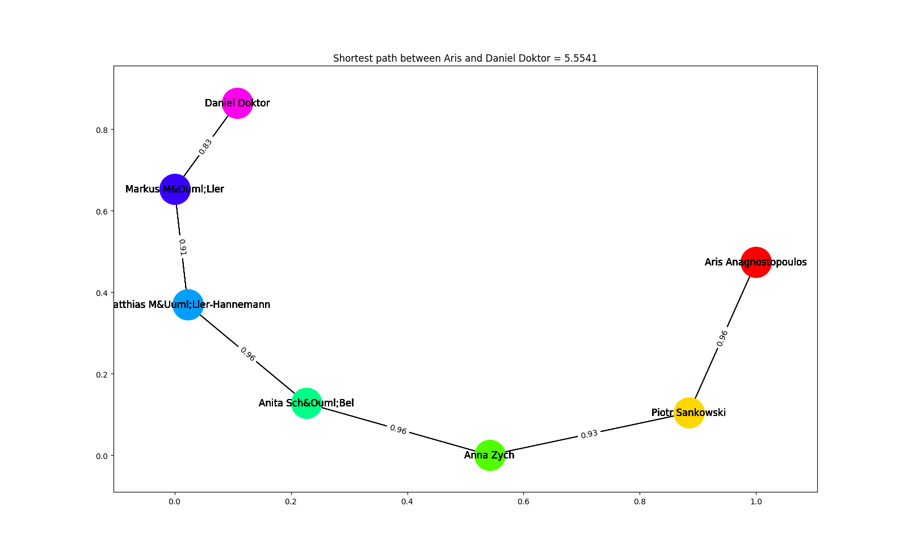

```{r setup, include=FALSE}
knitr::opts_chunk$set(echo = TRUE)
```

## Exercise 1

For the first exercise we had to create a graph whose nodes are authors, and two nodes are connected if they share, at least, one publication. Each edge is weighted in the following way: $$w(a_1, a_2) = 1 - J(p_1, p_2)$$ Where $J(p_1, p_2)$ is the Jaccard similarity between the set of publications $p_1$ and $p_2$ of each author.

The resulting graph (when using the full dataset) is a disconnected graph with a total of 904664 nodes and 3679331 edges. The implication of being a disconnected graph is that not all nodes are reachable from every other node, meaning, for a specific pair of nodes $n_1$ and $n_2$, there might not be a path that connects $n_1$ and $n_2$. Moreover, if the weight of the edge, $w(a_1, a_2)$, between $a_1$ and $a_2$ is equal to 0 it means that nodes $a_1$ and $a_2$ only published between each other.

# Exercise 2

## Letter A

For this exercise we had to return the induced subgraph by the set of authors who published at a specific conference at least once. After creating the graph we analyse some centralities measures (degree, closeness and betweennes).

Let's check the results for conference 'any conference here' and visualize each centrality.

### Degree

### Closeness

### Betweennes 

## Letter B

On this exercise we had to get the subgraph induced by the nodes that have hop distance at most equal to a given integer, with a given author.

We observe two things:
    
1. Because the graph is not connected we can never get the whole graph, even for a big hop distance.
2. For a small number (between 6 and 10) of maximum hop distance we get almost the whole connected component for one author.

Let's see the behaviour observed on 2.

For author who has id = 256176 (Aris Anagnostopoulos), the connected component has 792279 nodes, if we try with maximum hop distance from 0 to 10 we have the following result.


Just to illustrate we show the graph for when maximum hop distance is equal to 1.


# Exercise 3

For this exercise we had to implement a strategy to find the shortest path, on letter A we had to find the shortest path between an author and Aris, for letter B we had to find the shortest path between each node on a set of nodes and all the other nodes in the graph.

To solve both problems we implemented Dijkstra's algorithm to find the shortest path. The implementation uses a priority queue (heap), to improve the performance. For letter A we stop the execution when we find the given author, in the other hand, on letter B we run Dijkstra's for each node on the subset of nodes and then get the minimum value for each node, if two nodes are not connected we set the distance as infinity.

Below we show some results for the shortest path between Aris and some authors.





It is important to notice that Aris is not connected to all the authors, so for some authors there will not be a shortest path between them and Aris.